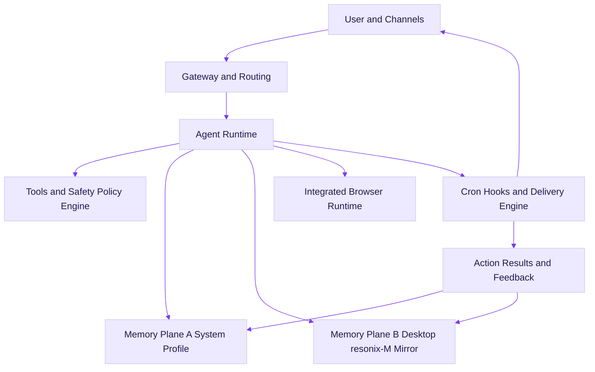
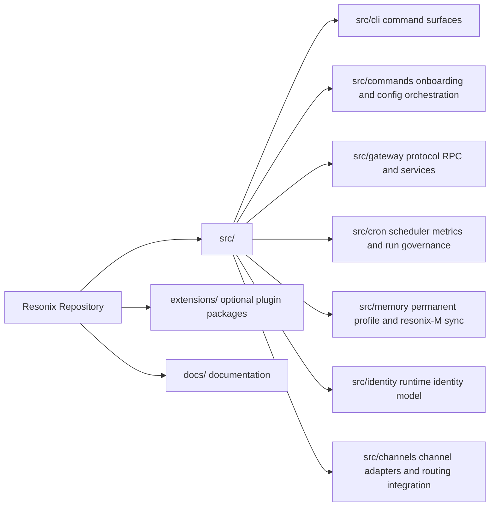

<div align="center">

# 👾 Resonix

**Version `2026.3.4`**

**Autonomous agent runtime with permanent memory, self-growth loops, and an integrated browser stack.**

> "Heyy man! I'm not some chatbot. I'm your digital roommate who happens to run on code. I remember what matters, keep learning, and still let you stay in control."

Built by **MarkEllington**.

[](LICENSE)
[](https://discord.gg/FKXPBAtPwG)
[](https://x.com/moralesjavx1032)

</div>

## Why Resonix

Resonix is a production-focused autonomous runtime derived from the OpenClaw ecosystem, with a clear product direction:

- **Permanent knowledge continuity** instead of short-lived session memory.
- **Autonomy with feedback** so the system improves from outcomes.
- **Operational readiness** for real deployment, not only demos.

Professional by architecture, relaxed in tone.

## What Resonix Is Great At

| Capability | What it does | Why it matters |
| --- | --- | --- |
| Two-layer permanent memory | System profile + Desktop `resonix-M` mirror | Durable knowledge + human-auditable memory |
| Autonomous growth loop | Captures outcomes, retrospectives, corrective signals | Fewer repeated mistakes over time |
| Integrated browser runtime | Built-in Playwright-based browser flow | Reliable browser automation without extension dependency |
| Cron intelligence board | Success/error trend, p95 duration, risk view | Production visibility for scheduled automation |
| Auth/onboarding hardening | Dispatch fixes + timeout fallback | Reduced auth stalls and silent failures |
| Cross-platform deployment | macOS/Linux/Windows/Termux scripts | Fast setup where users actually are |

## Runtime Architecture Map



### Runtime Architecture Map (Plain Text Fallback)

```text
User and Channels
  -> Gateway and Routing
  -> Agent Runtime
     -> Tools and Safety Policy Engine
     -> Memory Plane A (System Profile)
     -> Memory Plane B (Desktop resonix-M Mirror)
     -> Integrated Browser Runtime
     -> Cron, Hooks, Delivery Engine
     -> Action Results and Feedback
        -> Memory Plane A
        -> Memory Plane B
  -> User and Channels
```

## Permanent Memory and Self Growth

Resonix memory is a **dual-plane permanent system**, not temporary in-memory context.

1. **Memory Plane A: System Permanent Profile**
- Location: `src/memory/permanent-profile.ts`
- Purpose: machine-readable durable memory for retrieval continuity
- Stores: preferences, project facts, relationship context, recurring patterns, confidence scores, source traces

2. **Memory Plane B: Human-visible `resonix-M` Mirror**
- Location: `src/memory/resonix-m.ts`
- Purpose: inspectable long-term knowledge workspace
- Default folder: `~/Desktop/resonix-M`

```text
~/Desktop/resonix-M/
  identity/
  knowledge/
  autonomy/
  retrospectives/
  logs/
```

### Growth Loop

- Task outcomes are summarized into retrospectives.
- Useful context is promoted into permanent profile fields.
- Future runs retrieve this memory to avoid repeating the same mistakes.

Yes, it remembers your preferences. No, it will not roast your TODO list.

## Deployment and Troubleshooting

### Deployment Matrix

| Platform | Install Mode | Script |
| --- | --- | --- |
| macOS | One-line installer | `install.sh` |
| Linux | One-line installer | `install.sh` |
| Windows | PowerShell installer | `install.ps1` |
| Termux (Android) | Termux installer | `install-termux.sh` |

### Copy and Run

macOS / Linux:

```bash
curl -fsSL https://raw.githubusercontent.com/mangiapanejohn-dev/Resonix-AG/main/install.sh | bash
```

Windows (PowerShell):

```powershell
iwr -useb https://raw.githubusercontent.com/mangiapanejohn-dev/Resonix-AG/main/install.ps1 | iex
```

Termux (Android):

```bash
curl -fsSL https://raw.githubusercontent.com/mangiapanejohn-dev/Resonix-AG/main/install-termux.sh | bash
```

### Verify After Install

```bash
resonix -v
resonix onboard
```

### Troubleshooting Quick Fixes

**Windows installer exits immediately**

- Use PowerShell (Windows PowerShell 5.1+ or PowerShell 7+).
- Ensure Node.js 22+ is installed and available in PATH.
- Re-run with explicit execution policy:

```powershell
Set-ExecutionPolicy -Scope Process Bypass
iwr -useb https://raw.githubusercontent.com/mangiapanejohn-dev/Resonix-AG/main/install.ps1 | iex
```

**`resonix` command not found after install**

- Open a new terminal session first.
- If still missing, run from launcher path:
  - macOS/Linux: `~/.local/bin/resonix -v`
  - Windows: `%LOCALAPPDATA%\\Resonix\\bin\\resonix.cmd -v`
  - Termux: `$PREFIX/bin/resonix -v`
- Re-run installer if launcher file is missing.

**Termux script fails on desktop OS**

- `install-termux.sh` is Termux-only.
- Run it inside Termux where `pkg` exists.

## Operations Quick Start

```bash
resonix onboard
resonix gateway start
resonix gateway status
resonix cron board
resonix memory profile
```

## What Is New In `2026.3.4`

- Hardened provider auth dispatch to avoid skipped auth handlers.
- Added timeout fallback for plugin auth loading to reduce onboarding stall paths.
- Improved installer UX with stronger failure handling.
- Added dedicated Termux deployment path.
- Unified release version metadata and installer messaging.

## Resonix vs OpenClaw (Fork Direction)

| Area | Resonix `2026.3.4` | Typical OpenClaw baseline |
| --- | --- | --- |
| Memory strategy | Dual-plane permanent memory + Desktop mirror (`resonix-M`) | Mostly runtime/session-centric memory flow |
| Identity continuity | Explicit Resonix identity profile integrated in runtime behavior | No fork-specific identity continuity layer by default |
| Onboarding resilience | Auth dispatch hardening + plugin loader timeout fallback | Standard provider auth flow |
| Browser posture | Integrated browser runtime and profile-isolated behavior | Common extension-centric or provider-specific flows |
| Cron operations | Board-level observability + run-governance hooks | Core scheduler operations |
| Installer coverage | macOS/Linux/Windows + Termux one-line path | Depends on upstream release track |

## Repository Structure

### Repository Runtime Architecture



### Repository Runtime Architecture (Plain Text Fallback)

```text
src/
  cli/             # command surfaces
  commands/        # onboarding/auth/config orchestration
  gateway/         # protocol, RPC, services
  cron/            # scheduler, board metrics, run governance
  memory/          # permanent profile and resonix-M sync
  identity/        # runtime identity model
  channels/        # channel adapters and routing integration
extensions/        # optional plugin packages
docs/              # documentation
```

## Development

```bash
pnpm install
pnpm build
pnpm test
```

Focused checks for critical paths:

```bash
pnpm test src/commands/auth-choice.e2e.test.ts
pnpm test src/gateway/server.cron.e2e.test.ts
pnpm test src/memory/permanent-profile.test.ts src/memory/resonix-m.test.ts
```

## Community

- Discord: <https://discord.gg/FKXPBAtPwG>
- X: <https://x.com/moralesjavx1032>

## License

MIT

---

**Resonix is developed by MarkEllington.**
