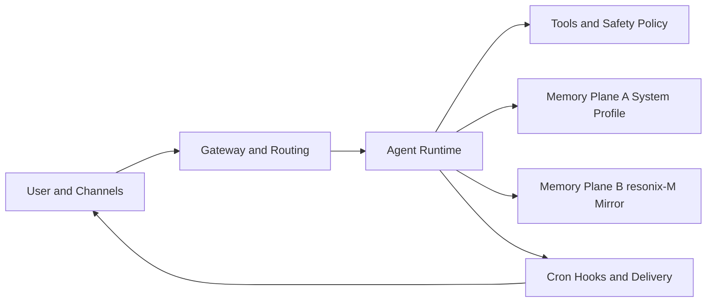

<div align="center">

# 👾 Resonix

**Version `2026.3.4`**

**Autonomous agent runtime with a two-layer permanent memory architecture.**

> "Heyy man! I'm not some chatbot. I'm your digital roommate who runs on code. I browse when you're lazy, remember what matters, and get better after every mission."

Built by **MarkEllington**.

[](LICENSE)
[](https://discord.gg/FKXPBAtPwG)
[](https://x.com/moralesjavx1032)

</div>

## Why Resonix

Resonix is a production-focused autonomous runtime derived from the OpenClaw ecosystem, but optimized for a different end state:

- Durable identity
- Persistent knowledge continuity
- Operational reliability across real deployments

Resonix is designed to feel like a long-term digital collaborator, not a stateless chat session.

## At A Glance

- **Two-layer permanent memory architecture**
- **Faster onboarding/auth path with stall hardening**
- **Cron intelligence board with runtime observability**
- **Cross-platform one-line installers (macOS/Linux/Windows/Termux)**
- **Identity-aware runtime behavior and prompt anchoring**

## Architecture

### Runtime Architecture



### Runtime Architecture (Plain Text Fallback)

```text
User and Channels
  -> Gateway and Routing
  -> Agent Runtime
     -> Tools and Safety Policy
     -> Memory Plane A (System Profile)
     -> Memory Plane B (resonix-M Mirror)
     -> Cron, Hooks, Delivery
  -> User and Channels
```

### Permanent Memory Architecture (Core)

Resonix memory is a **dual-plane permanent system**, not temporary in-memory context.

1. **Memory Plane A: System Permanent Profile**
- Location: runtime modules (`src/memory/permanent-profile.ts`)
- Purpose: durable machine-readable memory for retrieval and reasoning continuity
- Stores: preferences, project facts, relationship context, recurring patterns, confidence scores, source traces

2. **Memory Plane B: `resonix-M` Knowledge Mirror**
- Location: sync modules (`src/memory/resonix-m.ts`)
- Purpose: human-visible, inspectable and auditable long-term memory workspace
- Default folder: `~/Desktop/resonix-M`

```text
~/Desktop/resonix-M/
  identity/
  knowledge/
  autonomy/
  retrospectives/
  logs/
```

This two-layer design gives you both:
- Fast runtime recall for the agent
- Transparent memory artifacts for humans

## Deployment Matrix

| Platform | Install Mode | Copy Option |
| --- | --- | --- |
| macOS | One-line installer | Use copy block below |
| Linux | One-line installer | Use copy block below |
| Windows | PowerShell installer | Use copy block below |
| Termux (Android) | Termux installer | Use copy block below |

### Copy Ready Install Commands

macOS / Linux:

```bash
curl -fsSL https://raw.githubusercontent.com/mangiapanejohn-dev/Resonix-AG/main/install.sh | bash
```

Windows (PowerShell):

```powershell
iwr -useb https://raw.githubusercontent.com/mangiapanejohn-dev/Resonix-AG/main/install.ps1 | iex
```

Termux (Android):

```bash
curl -fsSL https://raw.githubusercontent.com/mangiapanejohn-dev/Resonix-AG/main/install-termux.sh | bash
```

## Quick Start

```bash
resonix -v
resonix onboard
resonix gateway start
resonix cron board
resonix memory profile
```

If command lookup is stale, open a new terminal session.

## What Is New In `2026.3.4`

- Hardened provider auth dispatch to avoid skipped auth handlers.
- Added timeout fallback for plugin auth loading to reduce onboarding stall paths.
- Improved installer experience with stronger UX and clearer failure handling.
- Added dedicated Termux deployment path.
- Unified release version metadata and installer messaging.

## Cron Intelligence

Resonix cron is more than timer CRUD.

`resonix cron board` provides:
- Success/error trend
- p95 duration and execution behavior
- Failure streak visibility
- Due-risk insight
- Memory-template execution context visibility

This makes scheduled automation observable and debuggable in production.

## Resonix vs OpenClaw (Fork Direction)

| Area | Resonix `2026.3.4` | Typical OpenClaw baseline |
| --- | --- | --- |
| Memory strategy | Dual-plane permanent memory + Desktop mirror (`resonix-M`) | Mostly runtime/session-centric memory flow |
| Identity continuity | Explicit Resonix identity profile integrated in runtime behavior | No fork-specific identity continuity layer by default |
| Onboarding resilience | Auth dispatch hardening + plugin loader timeout fallback | Standard provider auth flow |
| Cron operations | Board-level observability + run-governance hooks | Core scheduler operations |
| Installer coverage | macOS/Linux/Windows + Termux one-line path | Depends on upstream release track |

## Repository Structure

```text
src/
  cli/             # command surfaces
  commands/        # onboarding/auth/config orchestration
  gateway/         # protocol, RPC, services
  cron/            # scheduler, board metrics, run governance
  memory/          # permanent profile and resonix-M sync
  identity/        # runtime identity model
  channels/        # channel adapters and routing integration
extensions/        # optional plugin packages
docs/              # documentation
```

## Development

```bash
pnpm install
pnpm build
pnpm test
```

Focused checks for critical paths:

```bash
pnpm test src/commands/auth-choice.e2e.test.ts
pnpm test src/gateway/server.cron.e2e.test.ts
pnpm test src/memory/permanent-profile.test.ts src/memory/resonix-m.test.ts
```

## Troubleshooting

### Windows installer exits immediately

- Use PowerShell (Windows PowerShell 5.1+ or PowerShell 7+).
- Ensure Node.js 22+ is installed and available in PATH.
- Re-run with explicit execution policy if needed:

```powershell
Set-ExecutionPolicy -Scope Process Bypass
iwr -useb https://raw.githubusercontent.com/mangiapanejohn-dev/Resonix-AG/main/install.ps1 | iex
```

### `resonix` command not found after install

- Open a new terminal session.
- Or invoke via absolute path from the installer output directory.

### Termux script fails on desktop OS

- `install-termux.sh` is intentionally Termux-only.
- Run it inside Termux where `pkg` is available.

## Community

- Discord: <https://discord.gg/FKXPBAtPwG>
- X: <https://x.com/moralesjavx1032>

## License

MIT

---

**Resonix is developed by MarkEllington.**
