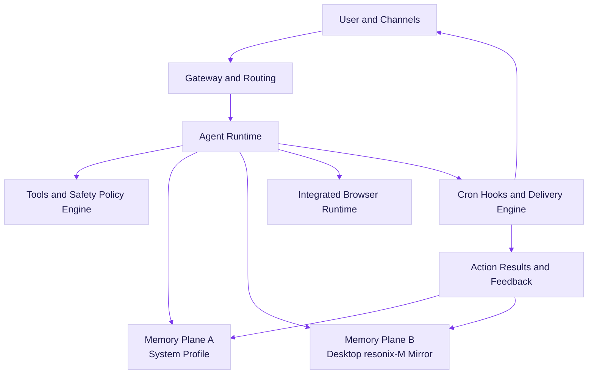
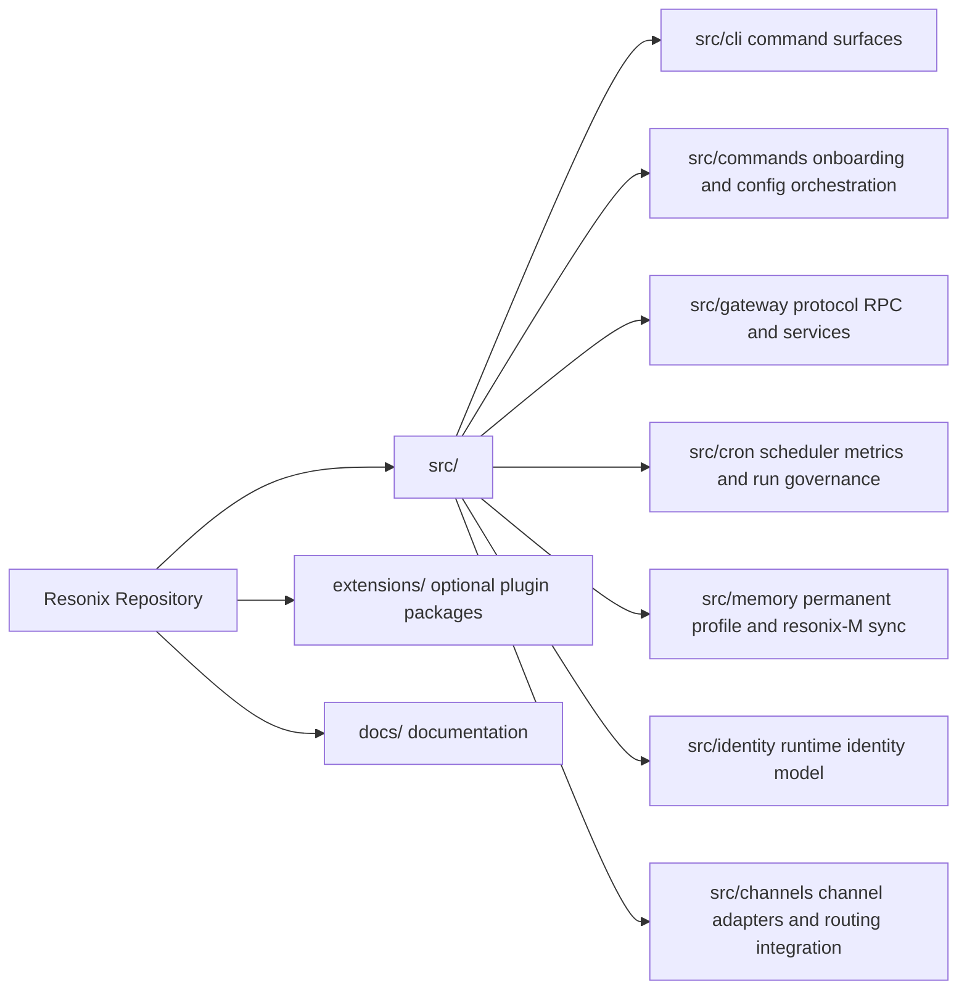

---

<div align="center">🌀 Resonix AG

Version 2026.3.4

Autonomous agent runtime with permanent memory, self-growth loops, and an integrated browser stack.

"Hey man! I'm not just a chatbot. I'm your digital roommate who happens to run on code. I remember what matters, keep learning, and still let you stay in control."

Built by MarkEllington.

https://img.shields.io/badge/License-MIT-blue.svg?style=for-the-badge
https://img.shields.io/discord/FKXPBAtPwG?label=Discord&logo=discord&style=for-the-badge
https://img.shields.io/twitter/follow/moralesjavx1032?logo=X&style=for-the-badge

</div>---

✨ Why Resonix?

Resonix is a production-focused autonomous runtime derived from the OpenClaw ecosystem, designed to give you an AI that remembers, learns, and acts reliably—without constant hand-holding.

· 🧠 Permanent Knowledge Continuity – No more session amnesia. Resonix builds a durable memory across interactions.
· 🔄 Autonomy with Feedback – It learns from outcomes and improves over time.
· 🚀 Operational Readiness – Built for real-world deployment, not just demos.

---

🎯 What Resonix Is Great At

Capability What it does Why it matters
Two-layer permanent memory System profile + Desktop resonix-M mirror Durable knowledge + human-auditable memory
Autonomous growth loop Captures outcomes, retrospectives, corrective signals Fewer repeated mistakes over time
Integrated browser runtime Built-in Playwright-based browser flow Reliable browser automation without extension dependency
Cron intelligence board Success/error trend, p95 duration, risk view Production visibility for scheduled automation
Auth/onboarding hardening Dispatch fixes + timeout fallback Reduced auth stalls and silent failures
Cross-platform deployment macOS/Linux/Windows/Termux scripts Fast setup where users actually are

---

🚀 Quick Start

Get Resonix up and running in minutes.

One-line Installation

macOS / Linux:

```bash
curl -fsSL https://raw.githubusercontent.com/mangiapanejohn-dev/Resonix-AG/main/install.sh | bash
```

Windows (PowerShell):

```powershell
iwr -useb https://raw.githubusercontent.com/mangiapanejohn-dev/Resonix-AG/main/install.ps1 | iex
```

Termux (Android):

```bash
curl -fsSL https://raw.githubusercontent.com/mangiapanejohn-dev/Resonix-AG/main/install-termux.sh | bash
```

Verify & Onboard

```bash
resonix -v
resonix onboard
```

Basic Operations

```bash
resonix gateway start      # Start the gateway
resonix gateway status     # Check status
resonix cron board         # View cron intelligence
resonix memory profile     # Inspect permanent memory
```

---

🧠 Core Concepts

Dual‑Plane Permanent Memory

Resonix memory isn't temporary—it's a dual‑plane permanent system.

1. Memory Plane A: System Permanent Profile
   · Machine‑readable durable memory for retrieval continuity.
   · Stores preferences, project facts, relationship context, recurring patterns, confidence scores, source traces.
   · Located at src/memory/permanent-profile.ts.
2. Memory Plane B: Human‑visible resonix-M Mirror
   · Inspectable long‑term knowledge workspace.
   · Default folder: ~/Desktop/resonix-M/
   ```text
   ~/Desktop/resonix-M/
     identity/
     knowledge/
     autonomy/
     retrospectives/
     logs/
   ```

Self‑Growth Loop

· Task outcomes are summarized into retrospectives.
· Useful context is promoted into permanent profile fields.
· Future runs retrieve this memory to avoid repeating mistakes.

Yes, it remembers your preferences. No, it will not roast your TODO list.

---

🏗 Runtime Architecture



Text version:

```text
User and Channels → Gateway and Routing → Agent Runtime
    → Tools and Safety Policy Engine
    → Memory Plane A (System Profile)
    → Memory Plane B (Desktop resonix-M Mirror)
    → Integrated Browser Runtime
    → Cron, Hooks, Delivery Engine → Action Results and Feedback
        → Memory Plane A
        → Memory Plane B
    → User and Channels
```

---

🛠 Deployment & Troubleshooting

Supported Platforms & Installers

Platform Install Mode Script
macOS One‑line installer install.sh
Linux One‑line installer install.sh
Windows PowerShell installer install.ps1
Termux (Android) Termux installer install-termux.sh

Common Issues & Fixes

Issue Solution
Windows installer exits immediately Use PowerShell 5.1+ or 7+. Ensure Node.js 22+ is in PATH. Run with bypass: Set-ExecutionPolicy -Scope Process Bypass then rerun the install command.
resonix command not found after install Open a new terminal. If still missing, run from launcher path: - macOS/Linux: ~/.local/bin/resonix -v - Windows: %LOCALAPPDATA%\Resonix\bin\resonix.cmd -v - Termux: $PREFIX/bin/resonix -v If launcher file missing, re‑run installer.
Termux script fails on desktop OS The install-termux.sh script is Termux‑only. Run it inside Termux where pkg exists.

---

🔄 Resonix vs OpenClaw (Fork Direction)

Area Resonix 2026.3.4 Typical OpenClaw baseline
Memory strategy Dual‑plane permanent memory + Desktop mirror (resonix-M) Mostly runtime/session‑centric memory flow
Identity continuity Explicit Resonix identity profile integrated in runtime behavior No fork‑specific identity continuity layer by default
Onboarding resilience Auth dispatch hardening + plugin loader timeout fallback Standard provider auth flow
Browser posture Integrated browser runtime and profile‑isolated behavior Common extension‑centric or provider‑specific flows
Cron operations Board‑level observability + run‑governance hooks Core scheduler operations
Installer coverage macOS/Linux/Windows + Termux one‑line path Depends on upstream release track

---

📦 Repository Structure



Text version:

```text
src/
  cli/             # command surfaces
  commands/        # onboarding/auth/config orchestration
  gateway/         # protocol, RPC, services
  cron/            # scheduler, board metrics, run governance
  memory/          # permanent profile and resonix-M sync
  identity/        # runtime identity model
  channels/        # channel adapters and routing integration
extensions/        # optional plugin packages
docs/              # documentation
```

---

📝 What's New in 2026.3.4

· Hardened provider auth dispatch to avoid skipped auth handlers.
· Added timeout fallback for plugin auth loading to reduce onboarding stall paths.
· Improved installer UX with stronger failure handling.
· Added dedicated Termux deployment path.
· Unified release version metadata and installer messaging.

---

🧑‍💻 Development

```bash
pnpm install
pnpm build
pnpm test
```

Run focused tests for critical paths:

```bash
pnpm test src/commands/auth-choice.e2e.test.ts
pnpm test src/gateway/server.cron.e2e.test.ts
pnpm test src/memory/permanent-profile.test.ts src/memory/resonix-m.test.ts
```

---

🤝 Contributing

We welcome contributions! Please see our CONTRIBUTING.md for guidelines.
If you have ideas or find bugs, open an issue or join our Discord.

---

🌐 Community

· Discord: https://discord.gg/FKXPBAtPwG
· X (Twitter): @moralesjavx1032

---

📜 License

MIT © MarkEllington. See LICENSE for details.

---

⭐ Star History

https://api.star-history.com/image?repos=mangiapanejohn-dev/Resonix-AG&type=timeline&legend=top-left

---

<div align="center">
  <strong>Resonix is developed by MarkEllington. Give it a ⭐ if you find it useful!</strong>
</div>---
