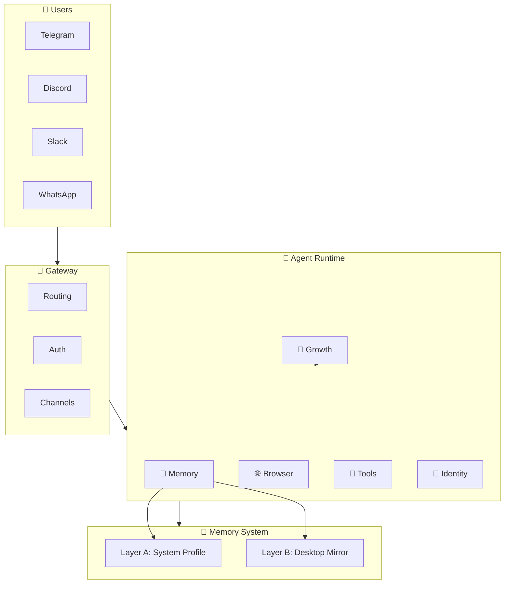

# 👾 Resonix

<p align="center">
  
</p>

<p align="center">
  <strong>Version 2026.3.12</strong><br/>
  An autonomous AI agent with permanent memory & self-learning capabilities
</p>

<p align="center">
  <a href="#">
    
  </a>
  <a href="https://discord.gg/FKXPBAtPwG">
    
  </a>
  <a href="https://x.com/moralesjavx1032">
    
  </a>
  
</p>

---

## 😢 Traditional AI Assistants

> **"What do I like?"**
>
> *"I don't know, you just told me."*

Every conversation starts from scratch. They forget everything.

---

## 🤩 Resonix Remembers

> **"What do I like?"**
>
> *"Based on our conversations, you prefer coffee over tea, usually take your coffee with oat milk, and you're a night owl who does your best work between 10PM-2AM."*

**Resonix actually remembers things.** It learns from every conversation and builds on past knowledge.

---

## ✨ Key Features

### 🧠 Two-Layer Permanent Memory

```
┌────────────────────────────────────────────────────────────────┐
│                     YOUR CONVERSATION                           │
└────────────────────────────┬─────────────────────────────────────┘
                           │
         ┌─────────────────┴─────────────────┐
         ▼                                   ▼
┌─────────────────────┐          ┌─────────────────────────────┐
│   LAYER A          │          │      LAYER B              │
│   System Profile    │          │   Desktop Mirror          │
│   (Machine-Ready)  │          │   (Human-Readable)        │
├─────────────────────┤          ├─────────────────────────────┤
│ • Preferences      │          │ ~/Desktop/resonix-M/      │
│ • Facts           │          │   ├── identity/           │
│ • Patterns        │          │   ├── knowledge/          │
│ • Confidence      │          │   ├── autonomy/           │
│ • Sources        │          │   ├── retrospectives/    │
└─────────────────────┘          │   └── logs/              │
                                └─────────────────────────────┘
```

### 🔄 Self-Growth Loop

```
TASK → RESULT → RETROSPECTIVE → LEARNING → BETTER NEXT TASK
  │                                              ▲
  └──────────────────────────────────────────────┘
```

> Every task outcome → summarized → stored → used for future tasks

### 🌐 Built-in Browser Control

| Without Resonix | With Resonix |
|-----------------|---------------|
| Chrome extensions that break | Playwright-powered reliability |
| Fragile selectors | Smart element detection |
| Manual screenshots | Automatic capture |
| "It worked yesterday" | Consistent automation |

### 📊 Cron Intelligence Board

```
┌──────────────────────────────────────────┐
│         CRON INTELLIGENCE BOARD           │
├──────────────────────────────────────────┤
│                                          │
│   ✅ Success    ████████████░░  82%      │
│   ❌ Errors     ████░░░░░░░░░░  18%      │
│   ⏱️ P95 Time   ████████████░░  2.3s      │
│   ⚠️  Risk     ██░░░░░░░░░░░░  Low       │
│                                          │
└──────────────────────────────────────────┘
```

---

## 🏗️ System Architecture



---

## 🚀 Quick Start

### One-Line Install

| Platform | Command |
|----------|---------|
| **macOS / Linux** | ```curl -fsSL https://resonix.ai/install.sh \| bash``` |
| **Windows** | ```iwr -useb https://resonix.ai/install.ps1 \| iex``` |
| **Termux** | ```curl -fsSL https://resonix.ai/install-termux.sh \| bash``` |

### Get Started

```bash
resonix -v              # Verify installation
resonix onboard         # First-time setup
resonix gateway          # Start the gateway
```

---

## 📱 Supported Channels

<p align="center">
  
  
  
  
  </img>
  
  
</p>

---

## 📂 What Resonix Remembers

```
~/Desktop/resonix-M/
│
├── identity/           # "Mark is a 14-year-old developer from Hong Kong"
├── knowledge/          # "Coffee with oat milk, not tea"
├── autonomy/           # "Learns faster when given examples"
├── retrospectives/     # "Don't use regex for HTML parsing"
└── logs/              # Conversation history
```

---

## 🎯 Resonix vs Traditional Assistants

| Feature | ChatGPT / Claude / Gemini | Resonix |
|---------|---------------------------|---------|
| **Memory** | Context window only | Permanent + Desktop mirror |
| **Learning** | Starts fresh each chat | Remembers & learns |
| **Identity** | Generic | Knows who you are |
| **Browser** | Extensions / API | Built-in Playwright |
| **Persistence** | Session-based | Long-term storage |

---

## 🛠️ Commands

| Command | Description |
|---------|-------------|
| `resonix onboard` | First-time setup |
| `resonix gateway` | Start the gateway |
| `resonix gateway status` | Check status |
| `resonix cron board` | View scheduled tasks |
| `resonix memory profile` | View learned profile |

---

## 🤝 Contributing

```bash
# Clone the repo
git clone https://github.com/mangiapanejohn-dev/Resonix-AG.git
cd Resonix-AG

# Install dependencies
pnpm install

# Build
pnpm build

# Test
pnpm test
```

---

## 📚 Documentation

- **Docs**: [docs.resonix.ai](https://docs.resonix.ai)
- **Discord**: [Join our community](https://discord.gg/FKXPBAtPwG)
- **X**: [Follow us](https://x.com/moralesjavx1032)

---

## ⭐ Show Your Support

> **If Resonix helped you, we'd love a ⭐!**

It motivates me to keep building and improving. 💪

---

## 📄 License

MIT License - Built by [MarkEllington](https://github.com/mangiapanejohn-dev)

---

<p align="center">
  <sub>Made with ❤️ by a 14-year-old developer</sub>
</p>
